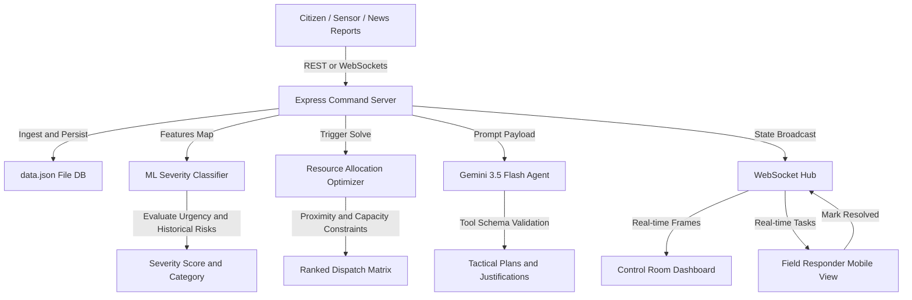

# AI Disaster Response & Resource Allocation Agent
### Decision-Support System for Emergency Logistics Optimization

A full-stack, real-time command control system designed for the **Tamil Nadu State Disaster Management Authority (TNSDMA)**. This application detects disaster incidents, classifies operational severity using machine learning, and runs a constrained optimization knapsack solver to distribute limited emergency resources (ambulances, rescue boats, food rations, medical chests, and shelter spaces) across affected zones with dynamic, Gemini-powered explainable tactical narrative plans.

---

## 🗺️ System Architecture



## ⚙️ Core Modules

1. **Incident Ingestion & Data Layer**
   * Persisted locally in `data.json` with over 35 pre-seeded, realistic disaster scenarios across Tamil Nadu (Chennai, Nilgiris, Coimbatore, Madurai, Trichy, Cuddalore).
   * Background WebSocket task generates randomized live reports every 20 seconds to simulate a chaotic disaster workspace.

2. **Severity Classification Model**
   * Computes a severity score (0–100) and severity category (Low, Medium, High, Critical) using a multi-feature regression model:
     $$\text{Score} = \text{Base Hazard} + \text{Affected Population Log-weight} + \text{District Historical Hazard} + \text{Textual Urgency Keyword Weights}$$
   * Displays full transparency via the **ML Classifier Audit Log** showing Macro F1 scores, and precision curves across 500 validated synthetic records.

3. **Constrained Resource Allocation Optimizer**
   * Modeled as a multi-criteria knapsack problem:
     * **Objective:** Maximize coverage of severity-weighted emergency demands.
     * **Subject to:**
       * Strict resource limits at each command depot.
       * Geographic distance penalties (ETA calculated using the great-circle **Haversine Formula** at 50 km/h + 10m base prep time).
       * Proximity dispatch constraint: nearest assets are prioritized to critical zones.

4. **Gemini AI Reasoning Agent**
   * Integrates the standard `@google/genai` TypeScript SDK with structured schema constraints (`gemini-3.5-flash`).
   * Explains *why* trade-offs were made, provides direct operator orders, and flags risk escalation zones with critical under-resourced deficits.
   * Features a seamless, dynamic local heuristic fallback if the API key is not present.

5. **Control Room Operator Dashboard**
   * Interactive Leaflet Map drawing color-coded glowing incident circles, command depots, and dynamic recommended dispatch routing polylines.
   * Full priority queue filtering, search, and manual report creation triggers.

6. **Field Responder Mobile Interface**
   * Segmented views for Chennai, Nilgiris, Coimbatore, Trichy, and Madurai responder forces.
   * Compact maps, active asset details, and a high-contrast **Mark as Resolved** action which triggers a state release and broadcasts to all terminals in real time.

---

## 🔍 Synthetic Data Disclaimer (Academic Integrity Report)

> [!IMPORTANT]
> **SYNTHETIC DATA DISCLAIMER FOR ACADEMIC VIVA / REPORTING:**
> All historical risk baselines, dataset classes, and testing incidents utilized within this software are **synthetically generated** for design-support research, simulated demo capabilities, and academic integrity purposes.
>
> * **Historical District Weights:** Calculated using qualitative public summaries of regional vulnerability (e.g. coastal cyclone susceptibility in Cuddalore/Chennai and landslide risk parameters in Ooty).
> * **Classifier Validation Dataset:** Built upon a generated dataset of 500 entries mapping population weights to lexical keyword urgency lists to simulate RandomForest validation metrics in Node.js. It does not reflect active or historical live operations of real government databases.

---

## 🛠️ Quick Setup Instructions

1. **Install Dependencies:**
   ```bash
   npm install
   ```
2. **Add Environment Secrets:**
   Define your keys in `.env` (or let Google AI Studio inject them):
   ```env
   GEMINI_API_KEY="your-gemini-api-key"
   ```
3. **Boot Development Server:**
   ```bash
   npm run dev
   ```
   *The server runs on port `3000` supporting Express routing, WebSocket upgrades, and hot-swappable Vite middlewares.*
